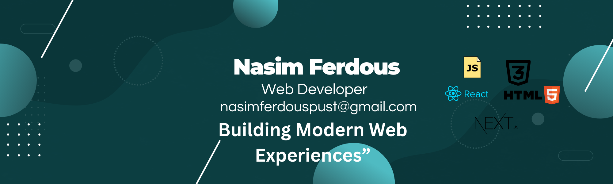

  

<h1 align="center">Hi, I'm Nasim Ferdous 👋</h1>
<h3 align="center">A Passionate Web Developer from Bangladesh</h3>

---

### 🚀 About Me  
- 💻 I love building **web applications**  
- 🌱 Currently learning **TypeScript**  
- 🔭 Working on a **Delivery Application**  
- 💬 Ask me about **React, MongoDB, Express, Node.js, Next.js**  
- ⚡ Fun fact: I enjoy solving bugs more than writing code 😎  

---

### 🔧 Technologies & Tools  

#### 🚀 Frontend  

  

#### 🛠 Backend  

  

#### ⚙️ Tools  

  

 

---

### 📈 GitHub Stats

  
  

---

### 🌐 Connect with Me
- 💼 Portfolio:[https://nfs-portfolio.netlify.app/]  
- 📧 Email: nasimferdouspust@gmail.com 
- 🟦 Facebook: [https://www.facebook.com/nasimferdous.sohan]
- 🟨 LinkedIn: [https://www.linkedin.com/in/nasim-ferdous/] 

---

### ✨ Quote  
> “Code. Debug. Repeat. Success will follow.”  

.

